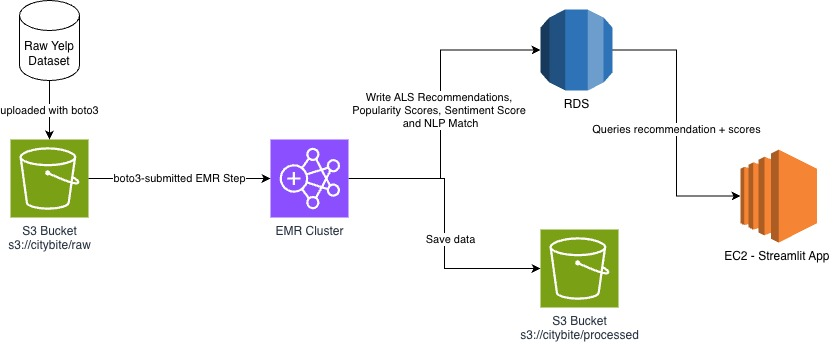

# CityBite

Restaurant popularity intelligence platform built on AWS. Processes 7M+ Yelp reviews through a two-zone S3 data lake on Amazon EMR, trains a Spark MLlib ALS recommender and scikit-learn sentiment classifier, and serves results through a Streamlit + Folium dashboard.

## Architecture



---

## Data Flow — Input to Output

```
┌─────────────────────────────────────────────────────────────────────────┐
│  INPUT: Yelp Academic Dataset (~9 GB, 7M+ reviews, 150K businesses)     │
└────────────────────────────────┬────────────────────────────────────────┘
                                 │  pipeline/upload.py  (boto3 multipart)
                                 ▼
┌─────────────────────────────────────────────────────────────────────────┐
│  S3 RAW ZONE   s3://citybite/raw/                                       │
│    business.json  ·  review.json  ·  user.json                          │
└────────────────────────────────┬────────────────────────────────────────┘
                                 │  pipeline/clean_job.py  (PySpark on EMR)
                                 │    • drop nulls / filter open businesses
                                 │    • join reviews + businesses
                                 │    • add recency_weight + grid_cell
                                 ▼
┌─────────────────────────────────────────────────────────────────────────┐
│  S3 PROCESSED ZONE   s3://citybite/processed/                           │
│    reviews_enriched/city=Phoenix/   (Parquet, partitioned by city)      │
└────────────────────────────────┬────────────────────────────────────────┘
                                 │  pipeline/aggregate_job.py  (Spark SQL)
                                 │    • popularity_score per business
                                 │    • grid aggregates (0.1 x 0.1 deg cells)
                                 ▼
┌──────────────────────────────┐    ┌────────────────────────────────────┐
│  S3 GOLD ZONE                │    │  RDS PostgreSQL                    │
│  business_scores/ (Parquet)  │───>│    business_scores                 │
│  grid_aggregates/ (Parquet)  │    │    grid_aggregates                 │
└──────────────────────────────┘    └──────────────────┬─────────────────┘
                                                       │
                           ┌───────────────────────────┤
                           │                           │
              ml/als_train.py                  ml/sentiment.py
              Spark MLlib ALS                  sklearn TF-IDF +
              top-10 recs per user             LogisticRegression
                           │                           │
                           v                           v
                  als_recommendations           grid_sentiment
                       (RDS)                       (RDS)
                           └───────────────────────────┘
                                         │
                                         ▼
┌─────────────────────────────────────────────────────────────────────────┐
│  OUTPUT: Streamlit Dashboard  (dashboard/app.py)                        │
│    • Folium heatmap — grid cells colored by popularity score            │
│    • Personalized top-10 ALS restaurant recommendations                 │
│    • Neighborhood sentiment bar chart                                   │
└─────────────────────────────────────────────────────────────────────────┘
```

---

## End-to-End Walkthrough

Here's what happens to a review from the moment it's ingested to the moment it shows up on the map.

### Stage 1 — Ingest
Raw Yelp JSON files (business, review, user) go to the S3 **raw zone** via `pipeline/upload.py`. Files over 100 MB use multipart upload. Nothing is transformed here — just a straight copy.

### Stage 2 — Clean & Enrich (`pipeline/clean_job.py`)
A PySpark job on EMR reads the raw JSON, drops records missing `business_id`, `stars`, `text`, or `date`, and filters to open businesses (`is_open == 1`). Reviews are joined with businesses, then two derived columns are computed:

- **`recency_weight`** — `1 / (1 + days_since_review / 365)` discounts older reviews
- **`grid_cell`** — `floor(lat/0.1)*0.1_floor(lng/0.1)*0.1` snaps each business to an ~11 km² geographic cell

Output is partitioned Parquet in the S3 **processed zone** (`city=Phoenix/`, etc.).

### Stage 3 — Aggregate (`pipeline/aggregate_job.py`)
Spark SQL computes two datasets from the enriched reviews:

- **`business_scores`** — per-business `popularity_score = avg_rating * 0.4 + log(review_count+1) * 0.4 + recency_score * 0.2`
- **`grid_aggregates`** — per-cell averages of popularity, restaurant count, and dominant cuisine

Both are written to S3 (gold zone) and to RDS via JDBC for live dashboard queries.

### Stage 4 — ML Training
Two models train on the enriched reviews:

| Model | Input | Output | Stored in |
|---|---|---|---|
| ALS (Spark MLlib) | user × business star ratings | top-10 restaurant recs per user | `als_recommendations` (RDS) |
| Sentiment (sklearn) | review text + star label | % positive reviews per grid cell | `grid_sentiment` (RDS) |

### Stage 5 — Dashboard
The Streamlit app pulls everything from RDS on startup (cached 1 hour) and shows:

1. **Folium heatmap** — each circle is a grid cell; radius and color encode popularity score
2. **Recommendation panel** — paste any Yelp `user_id` to get ALS top-10 picks pinned on the map
3. **Sentiment chart** — neighborhoods ranked by positive-review percentage

---

## Key Formulas

These are the core calculations the system uses to score restaurants and neighborhoods.

**Recency weight** — applied to every review in `pipeline/clean_job.py`
```
recency_weight = 1 / (1 + days_since_review / 365)
```
A review from a year ago gets weight 0.5; three years ago gets ~0.25. This keeps scores from being dominated by old hype.

**Grid cell** — also in `clean_job.py`
```
grid_cell = f"{floor(lat/0.1)*0.1}_{floor(lng/0.1)*0.1}"
```
Rounds each restaurant's coordinates to the nearest 0.1° (~11 km²) box so neighborhoods can be compared at a consistent scale.

**Popularity score** — computed in `pipeline/aggregate_job.py`
```
popularity_score = 0.4 * avg_rating
                 + 0.4 * log(review_count + 1)
                 + 0.2 * avg(recency_weight)
```
The log on review count prevents a Yelp veteran with 10 000 reviews from completely burying a newer place with better recent ratings. Weights split evenly between quality and volume, with a small freshness bump.

**Sentiment score** — computed per neighborhood in `ml/sentiment.py`
```
sentiment_score = positive_count / (positive_count + negative_count)
```
3-star reviews are treated as neutral and excluded. Ranges 0–1.

**Bayesian satisfaction score** — used in `dashboard/app.py` for the ranked sentiment chart
```
satisfaction = (positive + k * global_rate) / (positive + negative + k) × 10
```
`k = 30` pseudo-counts. A neighborhood with only 5 reviews gets pulled toward the city average instead of floating to #1 on a lucky streak. Scaled to 0–10.

**NLP search score** — used when you type a query in the search bar (`ml/nlp_index.py`)
```
final_score = 0.6 * tfidf_cosine_similarity
            + 0.25 * log1p(review_count) / max_log_count
            + 0.15 * avg_rating / 5.0
```
Text relevance does most of the work; popularity and rating are tiebreakers.

---

## Repo Structure

```
citybite/
├── pipeline/
│   ├── upload.py          # Boto3 multipart upload -> S3 raw zone
│   ├── clean_job.py       # PySpark: raw JSON -> enriched reviews (partitioned by city)
│   ├── aggregate_job.py   # Spark SQL: popularity scores + grid aggregates -> RDS
│   └── submit_emr.py      # Submit jobs to EMR (transient or persistent cluster)
├── ml/
│   ├── als_train.py       # Spark MLlib ALS recommender (top-10 recs per user -> RDS)
│   ├── sentiment.py       # scikit-learn TF-IDF + LogisticRegression -> RDS
│   └── evaluate.py        # RMSE, precision@k evaluation helpers
├── dashboard/
│   └── app.py             # Streamlit app: Folium heatmap + rec panel + sentiment chart
├── infra/
│   ├── bootstrap.sh       # EMR bootstrap: pip-installs numpy/pandas/sqlalchemy/psycopg2
│   ├── create_rds.py      # Provision RDS PostgreSQL (db.t3.micro)
│   ├── schema.sql         # 4-table PostgreSQL schema
│   └── cron_setup.sh      # Nightly cron on EMR master node
├── data/
│   └── sample/
│       └── generate_sample.py  # Synthetic Yelp data for local dev
├── downloaded_data/            # Real Yelp JSON files (gitignored, ~9 GB)
├── tests/
│   └── test_sentiment.py  # 20 unit tests for sentiment pipeline (no AWS needed)
├── notebooks/
│   └── analysis.ipynb     # ALS + sentiment analysis notebook
├── requirements.txt
└── .env.example
```

---

## Prerequisites

- Python 3.10+
- Java 11 (required for PySpark local mode)
- AWS CLI configured (`aws configure`)

```bash
# Verify Java
java -version   # must be 11 or 17

# Windows: set JAVA_HOME if spark-submit can't find it
set JAVA_HOME=C:\Program Files\Eclipse Adoptium\jdk-11...
```

---

## Setup

```bash
python -m venv .venv

# Windows
.venv\Scripts\activate

# macOS / Linux
source .venv/bin/activate

pip install -r requirements.txt
cp .env.example .env   # fill in your AWS credentials and RDS endpoint
```

### `.env` reference

```
AWS_ACCESS_KEY_ID=...
AWS_SECRET_ACCESS_KEY=...
AWS_REGION=us-east-1
S3_BUCKET=citybite-560580021963

# Set to a running persistent cluster ID to submit steps to it.
# Comment out (or remove) to use auto-terminating transient clusters instead.
# EMR_CLUSTER_ID=j-XXXXXXXXXXXX

RDS_HOST=your-rds-endpoint.rds.amazonaws.com
RDS_PORT=5432
RDS_DB=citybite
RDS_USER=citybite_admin
RDS_PASSWORD=...
```

---

## Local Development (no AWS required)

### 1. Generate sample data

```bash
python data/sample/generate_sample.py
```

Creates synthetic Yelp-format JSON in `data/sample/` (~300 businesses, 3 000 reviews).

### 2. Run the cleaning pipeline locally

```bash
spark-submit pipeline/clean_job.py \
  --input  data/sample/ \
  --output data/processed/ \
  --mode   local
```

### 3. Run the aggregation pipeline locally

```bash
spark-submit pipeline/aggregate_job.py \
  --input  data/processed/ \
  --output data/gold/ \
  --mode   local
```

### 4. Run the ML models locally

```bash
# ALS recommender (writes to data/citybite_local.db)
spark-submit ml/als_train.py --input data/processed/ --mode local

# Sentiment classifier (trains sklearn model, writes grid scores to local DB)
spark-submit ml/sentiment.py --input data/processed/ --mode local
```

Expected results: ALS RMSE < 1.5, sentiment F1 > 0.80.

### 5. Launch the dashboard locally

```bash
streamlit run dashboard/app.py
```

The dashboard auto-detects `RDS_HOST` in `.env`. If it is not set it falls back to `data/citybite_local.db` (SQLite), so it works entirely offline after step 3.

Open `http://localhost:8501` in your browser.

### 6. Run unit tests

```bash
pytest tests/ -v
```

139 tests across 6 files — no AWS or network required:

| File | What it covers |
|---|---|
| `tests/test_clean_job.py` | PySpark ETL: business/review filtering, recency weight, grid cell, metro clustering |
| `tests/test_als_train.py` | ALS matrix building, training, RMSE, recommendations, DB write |
| `tests/test_sentiment.py` | TF-IDF classifier, Spark/pandas sentiment aggregation, DB write |
| `tests/test_dashboard.py` | Score coloring, neighborhood labels, Bayesian sentiment, NLP search |
| `tests/test_upload.py` | S3 key construction, multipart upload, verification (moto mock) |
| `tests/test_submit_emr.py` | EMR step building, cluster launch, script upload (moto mock) |

### 7. Run the analysis notebook

```bash
jupyter notebook notebooks/analysis.ipynb
```

Demonstrates the full pipeline end-to-end on local data: raw vs. processed distributions,
ALS RMSE curve, sentiment before/after Bayesian adjustment, spatial grid heatmaps,
and NLP search demo. All outputs saved to `assets/`.

---

## Downloading the Full Yelp Dataset

Required for the AWS pipeline. The zip (~4 GB download, ~9 GB uncompressed) contains several folders; only `yelp_dataset/` is needed.

```bash
# 1. Download
curl -L -o Yelp-JSON.zip https://business.yelp.com/external-assets/files/Yelp-JSON.zip

# 2. Extract only the dataset folder
unzip Yelp-JSON.zip 'yelp_dataset/*'

# 3. Move into downloaded_data/ and clean up
mkdir -p downloaded_data
mv yelp_dataset/* downloaded_data/
rm -rf yelp_dataset Yelp-JSON.zip
```

After extraction:

```
downloaded_data/
├── yelp_academic_dataset_business.json   (~120 MB)
├── yelp_academic_dataset_review.json     (~6.5 GB)
├── yelp_academic_dataset_user.json       (~3.3 GB)
└── yelp_academic_dataset_checkin.json
```

> `downloaded_data/` is gitignored — never commit it.

---

## AWS Pipeline

### Step 1 — Create S3 bucket

```bash
aws s3 mb s3://citybite-560580021963 --region us-east-1
```

### Step 2 — Upload Yelp data to S3

```bash
python pipeline/upload.py \
  --source downloaded_data/ \
  --bucket citybite-560580021963 \
  --prefix raw/
```

### Step 3 — Provision RDS

```bash
python infra/create_rds.py       # prints the RDS endpoint when done
# Copy the endpoint into .env as RDS_HOST, then apply schema:
psql -h $RDS_HOST -U $RDS_USER -d $RDS_DB -f infra/schema.sql
```

### Step 4 — IAM permissions

The IAM user running `submit_emr.py` needs:

- `AmazonEMRFullAccess` — to create / manage clusters and submit steps
- `AmazonS3FullAccess` — to read/write data and upload scripts
- `AmazonRDSFullAccess` — for the EC2 instance profile on EMR nodes

Attach these in the AWS Console: IAM > Users > your user > Add permissions.

### Step 5 — Run the cleaning and aggregation pipeline

```bash
# Spins up a transient cluster (spot core nodes, auto-terminates, ~$2-4)
python pipeline/submit_emr.py clean aggregate
```

Logs land at `s3://citybite-560580021963/logs/emr/<cluster-id>/`.

### Step 6 — Train ML models on EMR

```bash
# Transient cluster (recommended — cheapest, ~$2-4 per run)
python pipeline/submit_emr.py als sentiment

# Persistent / manually-created cluster
python pipeline/submit_emr.py setup   --cluster-id j-XXXXXXXXXXXX --wait
python pipeline/submit_emr.py als sentiment --cluster-id j-XXXXXXXXXXXX
```

The `setup` step must run first on any cluster that was **not** launched by `submit_emr.py` (e.g. created via the AWS console), because those clusters lack the bootstrap action that installs `numpy`, `pandas`, `sqlalchemy`, and `psycopg2-binary`.

Available jobs: `clean`, `aggregate`, `als`, `sentiment`, `setup`.

### Step 7 — Monitor progress

```bash
# One-shot status table
aws emr list-steps \
  --cluster-id j-XXXXXXXXXXXX \
  --query "Steps[*].[Name,Status.State]" \
  --output table

# PowerShell live poll (every 60 s)
while ($true) {
  aws emr list-steps --cluster-id j-XXXXXXXXXXXX \
    --query "Steps[*].[Name,Status.State]" --output table
  Start-Sleep 60
}
```

### Step 8 — Read step logs on Windows

```bash
aws s3 cp s3://citybite-560580021963/<cluster-id>/steps/<step-id>/stdout.gz stdout.gz
.venv\Scripts\python -c "import gzip; print(gzip.open('stdout.gz').read().decode())"
del stdout.gz
```

---

## S3 Zone Layout

```
s3://citybite-560580021963/
├── raw/
│   ├── business/yelp_academic_dataset_business.json
│   ├── review/yelp_academic_dataset_review.json
│   └── user/yelp_academic_dataset_user.json
├── processed/
│   ├── reviews_enriched/city=Phoenix/
│   ├── business_scores/city=Phoenix/
│   └── grid_aggregates/city=Phoenix/
├── scripts/        <- pipeline + ML scripts, auto-uploaded by submit_emr.py
└── logs/emr/       <- EMR step logs (only for transient clusters)
```

---

## Database Schema

| Table | Key columns | Written by |
|---|---|---|
| `business_scores` | `business_id`, `popularity_score`, `grid_cell` | `aggregate_job.py` |
| `grid_aggregates` | `grid_cell`, `avg_popularity`, `restaurant_count` | `aggregate_job.py` |
| `als_recommendations` | `user_id`, `business_id`, `predicted_rating`, `rank` | `als_train.py` |
| `grid_sentiment` | `grid_cell`, `sentiment_score`, `positive_count` | `sentiment.py` |

---

## Dashboard Features

- **Popularity heatmap** — 0.1° x 0.1° grid squares colored by weighted popularity score (CartoDB Positron basemap, loads automatically)
- **Cuisine filter** — sidebar dropdown derived live from the selected city's business data
- **Personalized recommendations** — enter a Yelp `user_id` to see top-10 ALS picks pinned on the map as numbered blue markers; city-filtered first, falls back to cross-city
- **Neighborhood labels** — grid cells labeled by compass direction from city center (e.g. "North District", "Downtown", "Southeast Side") throughout the map, sentiment chart, and tables
- **Sentiment chart** — bar chart of positive-review rate per neighborhood for the selected city

---

## Cost Estimate (3-week class project)

| Service | Config | Estimated cost |
|---|---|---|
| S3 | ~12 GB stored + requests | ~$0.50 |
| RDS | db.t3.micro, free tier | $0 (or ~$2/demo week) |
| EMR | Transient, spot core nodes, ~5 runs | ~$10-15 |
| EC2 dashboard | t3.micro (demo week only) | ~$2 |
| **Total** | | **~$12-20** |

> Transient cluster mode (`KeepJobFlowAliveWhenNoSteps=False`) prevents runaway charges from forgetting to terminate a cluster.

---

## Common Issues

**`ModuleNotFoundError: No module named 'dotenv'` on EMR**
Expected — `python-dotenv` is not installed on EMR nodes. The import is wrapped in `try/except` in all ML scripts; RDS credentials are passed via the cluster's `Configurations` block instead.

**EMR step fails in under 10 seconds with "Unknown Error"**
The cluster is missing the bootstrap action (usually a manually-created cluster). Run the `setup` job first:
```bash
python pipeline/submit_emr.py setup --cluster-id j-XXXXXXXXXXXX --wait
```

**`AccessDeniedException: not authorized to perform elasticmapreduce:RunJobFlow`**
The IAM user lacks permission to create clusters. Go to IAM > Users > your user > Add permissions > attach `AmazonEMRFullAccess`.

**RDS connection refused from EMR**
Add an inbound rule to the RDS security group allowing TCP port 5432 from the EMR master node's security group.

**ALS RMSE >= 1.5**
Re-run with `--cv` to enable cross-validated hyperparameter search:
```bash
python pipeline/submit_emr.py als --cluster-id j-XXXXXXXXXXXX
# edit als job config to pass --cv, then resubmit
```

**Folium map tiles blank in Streamlit**
`st_folium` intercepts tile-layer requests and only activates them after user interaction. The dashboard uses `components.html(m._repr_html_(), ...)` instead, which embeds the map as a self-contained iframe — tiles load immediately with no clicks required.

**PySpark can't find Java (local)**
```bash
# Linux / macOS
export JAVA_HOME=/usr/lib/jvm/java-11-openjdk-amd64

# Windows (PowerShell)
$env:JAVA_HOME = "C:\Program Files\Eclipse Adoptium\jdk-11.x.x-hotspot"
```

---

## Reproducibility

To reproduce results from scratch on the local sample dataset:

```bash
# 1. Generate sample data (if not already present)
python data/sample/generate_sample.py

# 2. Run the pipeline
spark-submit pipeline/clean_job.py --input data/sample/ --output data/processed/ --mode local
spark-submit pipeline/aggregate_job.py --input data/processed/ --output data/gold/ --mode local --skip-jdbc
spark-submit ml/als_train.py --input data/processed/ --mode local
spark-submit ml/sentiment.py --input data/processed/ --mode local

# 3. Open the dashboard
streamlit run dashboard/app.py

# 4. Run all unit tests
pytest tests/ -v
```

Expected: ALS RMSE < 1.5, sentiment F1 > 0.80. All 139 unit tests pass.
Sample data seed is fixed in `generate_sample.py` (`random.seed(42)`) for reproducible output.

---

## AI Assistance Disclosure

Portions of this project used Claude Code (Anthropic) as a coding assistant under the
[course AI policy](https://www.vanderbilt.edu). AI assistance was used for the following
**permitted uses**:

| Use | What the agent produced | How we validated it |
|---|---|---|
| Boilerplate code generation | boto3 multipart upload scaffolding, psycopg2 COPY pattern, Spark session setup | Manually reviewed and adapted; covered by unit tests |
| Unit test scaffolding | moto S3/EMR mock fixtures, PySpark test fixtures, pytest parametrize patterns | All 139 tests reviewed and run (`pytest tests/ -v`) |
| README and documentation drafting | Section structure, formula descriptions, troubleshooting entries | Reviewed and rewritten by authors for accuracy |
| Bug identification | Identified `_score_color` color inversion, non-deterministic `top_cuisine`, `add_neighborhood_labels` geocoding edge case | Each fix verified by the corresponding unit test |

**What the authors designed and are responsible for:**
- All pipeline architecture decisions (two-zone S3, EMR transient cluster strategy, JDBC/SQLite dual path)
- The recency weight, popularity score, and Bayesian sentiment formulas
- ML model selection (ALS rank/regParam choices, TF-IDF feature engineering)
- Dashboard layout, Folium map design, and NLP search blending weights
- Correctness of all results and interpretation of outputs

All generated code was unit-tested before submission. Potential failure scenarios were
identified and documented as part of the pre-submission audit.
